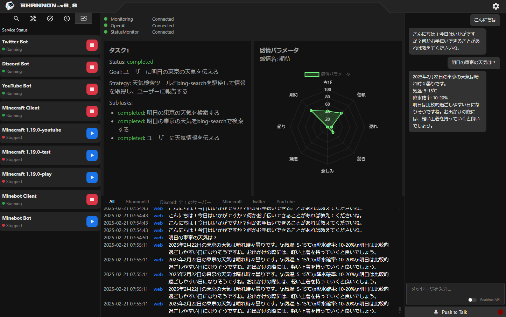

# SHANNON 


## 概要

Shannon2は、OpenAI APIを活用したマルチモーダルなAIアシスタントです。テキストチャット、リアルタイム音声会話、Twitter連携、Minecraftサーバー管理、Youtube連携、Discord Botなどの機能を備えています。

## デモ



## 特徴

- **テキストチャット**: WebインターフェースとDiscordを通じた対話が可能
- **リアルタイム音声会話**: VAD対応の音声チャットが可能
- **Twitter連携**: 定時ツイートや自動対話
- **Minecraftサーバー管理**: サーバーの起動/停止、状態監視
- **Youtube連携**: コメントの自動返信
- **Discord Bot**: サーバー管理やコミュニティ支援機能

## インストール

プロジェクトをローカル環境にセットアップする手順を以下に示します。

```bash
# リポジトリをクローン
git clone https://github.com/R41R41/Shannon2.git

# バックエンドのセットアップ
cd Shannon2/backend
npm install

# フロントエンドのセットアップ
cd ../frontend
npm install
```

## 使用方法

基本的な使用方法を以下に示します。詳細なガイドは[USAGE.md](USAGE.md)を参照してください。

```bash
# バックエンドの起動
cd backend
npm start

# フロントエンドの起動
cd frontend
npm run dev
```

## 開発者向け情報

開発者向けの詳細な情報は[DEVELOPER_GUIDE.md](DEVELOPER_GUIDE.md)を参照してください。