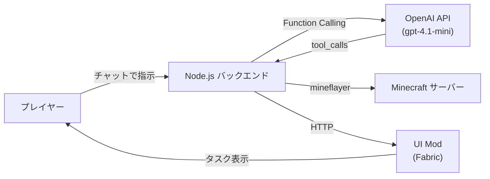
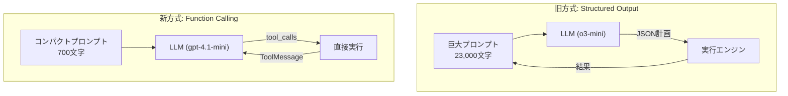

LLMにMinecraftのスキル（移動、採掘、釣り、戦闘…）を「道具」として渡したら、自然言語の指示だけで自律的にプレイできるボットができました。


*チャットで「魚を10匹釣って」と言うだけで、AIが水辺を探して釣りを始める*

## シャノンとは

**シャノン**は、Minecraftサーバー上で動作するAIボットです。

- プレイヤーがチャットで自然言語の指示を送ると、AIが自律的にタスクを実行
- **60種類以上のスキル**を持ち、採掘・建築・釣り・戦闘・農業・取引など幅広い行動が可能
- タスクの進捗はMinecraft内にリアルタイムで表示される（専用UI Mod）
- YouTubeで毎日ライブ配信中


*Minecraft内にタスク進捗がオーバーレイ表示される*

:::message
YouTubeチャンネル: [TODO: リンク]
:::

## システム全体像

仕組みはシンプルです。**LLMが頭脳、mineflayerが手足、UI Modが目**。



### LLM（頭脳）

OpenAIの**Function Calling**を使い、LLMがどのスキルをどの引数で呼ぶかを判断します。たとえば「魚を10匹釣って」という指示に対して、LLMは `fish(count=10)` というツール呼び出しを返します。

### スキルシステム（手足）

ボットが実行できる行動はすべて**スキル**として定義されています。

| カテゴリ | スキル例 |
|---------|---------|
| 移動 | `move-to`, `follow-entity`, `flee-from` |
| 採掘・建築 | `dig-block-at`, `place-block-at`, `fill-area`, `stair-mine` |
| 戦闘 | `attack-nearest`, `combat`, `set-shield` |
| 農業・食料 | `plant-crop`, `harvest-crop`, `breed-animal`, `fish` |
| インベントリ | `craft-one`, `deposit-to-container`, `check-recipe` |
| 情報収集 | `find-blocks`, `get-bot-status`, `investigate-terrain` |
| コミュニケーション | `chat`, `look-at` |

全60種類以上。これらがLLMから呼び出せる「道具」になります。

### UI Mod（目）

Fabric製のMinecraft Modで、ボットの状態やタスクの進捗をゲーム画面上にリアルタイム表示します。バックエンドとHTTP通信で連携しています。

## LLMの使い方 ― Function Calling

ここが技術的に一番面白いポイントです。

### 最初の設計（Structured Output方式）

当初は、LLMに**巨大なプロンプト**（ツール一覧、ルール、ボット状態、過去の実行結果…）を渡して、JSONで計画を返させていました。

```
システムプロンプト（23,000文字）
├── planning.md（行動ルール: 8,500文字）
├── ツール定義 60個分（名前、説明、引数）
├── ボット状態（HP、インベントリ、周囲ブロック…）
└── 過去の実行結果
```

LLMはこの情報を読み込んで、以下のようなJSON計画を生成します。

```json
{
  "goal": "魚を10匹釣る",
  "strategy": "水辺に移動して釣りを繰り返す",
  "nextActionSequence": [
    {"toolName": "find-blocks", "args": "{\"blockName\":\"water\"}"},
    {"toolName": "move-to", "args": "{\"x\":-5,\"y\":63,\"z\":14}"}
  ]
}
```

**問題**: プロンプトが巨大すぎてLLMの応答に**45秒以上**かかり、頻繁にタイムアウトしていました。

### 現在の設計（Function Calling方式）

OpenAIのFunction Callingを使うと、ツール定義はプロンプトではなく**APIの`tools`パラメータ**で渡せます。OpenAIが内部的に最適化してくれるため、プロンプト本体は**ボットの現在状態と基本ルールだけ**で済みます。



LLMが直接 `tool_calls` を返し、実行結果を `ToolMessage` として会話に追加。LLMが結果を見て次のアクションを決める ― というシンプルなループです。

### 結果

| | 旧方式 | 新方式 |
|---|---|---|
| プロンプトサイズ | 23,000文字 | **700文字（97%削減）** |
| LLM応答時間 | 45秒（タイムアウト頻発） | **1.2秒** |
| タスク完了 | 失敗が多い | **安定して成功** |

**30倍の高速化**。ツール定義をプロンプトから分離するだけで、これだけ変わります。

## 今後の展望

- **建築の自律化**: 設計図を渡して、ボットが自分でブロックを積む
- **マルチエージェント**: 複数のボットが役割分担して協力
- **視覚入力**: スクリーンショットからの状況判断（マルチモーダル）

YouTubeで毎日ライブ配信しています。シャノンの成長を見守ってください。

:::message
YouTubeチャンネル: [TODO: リンク]
X (Twitter): [TODO: リンク]
:::

## まとめ

LLMは「チャットボット」だけの技術ではありません。**道具（ツール）を与えれば、ゲームの世界で自律的に行動できる**。

Function Callingは、LLMをチャットの枠から解放して「エージェント」にするための鍵です。Minecraftに限らず、あらゆるAPI・ツールと組み合わせることで、同じパターンが応用できます。

もし興味を持ってもらえたら、**いいね**と**ストック**をお願いします。励みになります。
