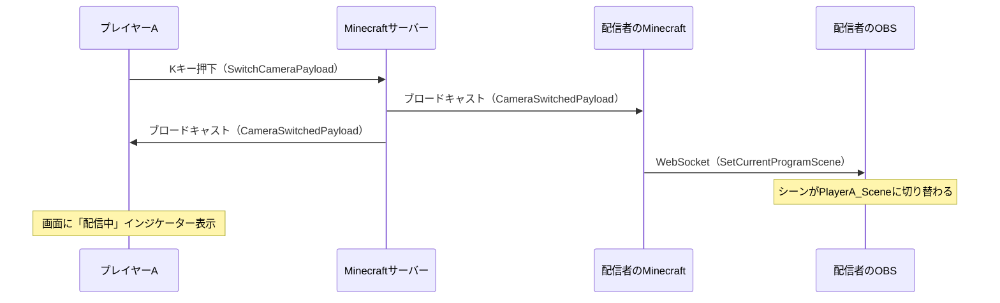
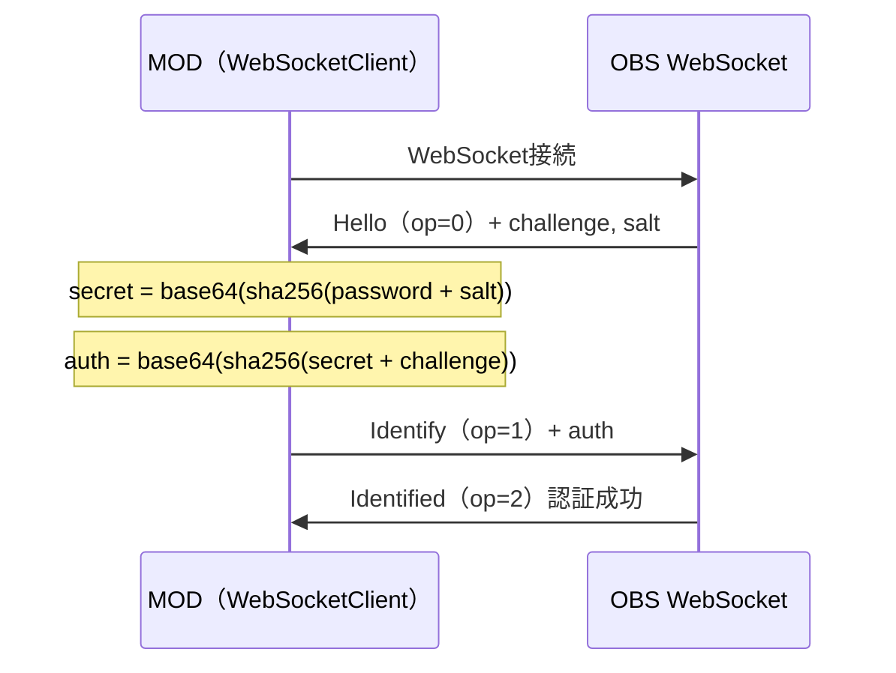

マルチプレイ配信で「今の俺の画面見てくれ！」と思った瞬間、**Kキーを押すだけ**で配信者のOBSが自分のカメラに切り替わる ― そんなFabric MODを作りました。


*プレイヤーがKキーを押すと、配信画面が瞬時に切り替わる*

## 何が課題だったのか

Minecraftのマルチプレイ配信でよくあるシーン:

> 「おい見てくれ！すごい洞窟見つけた！」
> 「ちょっと待って、OBS切り替えるから…（Alt+Tab）…えっとどのシーンだっけ…」

配信者が手動でOBSのシーンを切り替えるのは、想像以上にストレスです。

- 配信者がAlt+Tabしてゲームから離脱する
- シーンを探して切り替えるまで数秒のラグ
- 切り替え中は配信が中断される
- 参加者が増えるほど管理が煩雑

**このMODは、参加者自身がKキーを押すだけで配信カメラを切り替えられるようにすることで、この問題を解消します。**

## Before / After

| | Before（手動切り替え） | After（このMOD） |
|---|---|---|
| 操作者 | 配信者 | 見せたいプレイヤー本人 |
| 切り替え速度 | 数秒（Alt+Tab → シーン選択） | **瞬時**（Kキー1つ） |
| 配信の中断 | あり | **なし** |
| 配信者の負担 | 大（シーン管理が必要） | **なし**（自動で切り替わる） |
| 戻す操作 | 配信者が手動で戻す | **Kキーもう一度**で自動復帰 |

## システム全体像

仕組みは3つのレイヤーで構成されています。



### レイヤー1: Fabric Networking（Minecraft内通信）

プレイヤーのKキー押下をMinecraftサーバー経由で全員に通知します。サーバーの役割は**ブロードキャストのみ**で、シーン名の解決はしません。

### レイヤー2: OBS WebSocket 5.x（OBS制御）

配信者のPC上で、MODがOBSにWebSocket接続し、シーンを直接切り替えます。外部サーバー不要で、ローカル完結です。

### レイヤー3: VDO.Ninja（映像転送）

プレイヤーの画面をWebRTCで配信者に送ります。ブラウザだけで動くので、特別なソフトは不要です。

## 技術解説: OBS WebSocketでシーンを切り替える

ここからはエンジニア向けの技術解説です。

### OBS WebSocket 5.x プロトコル

OBS Studio 28以降に標準搭載されている**obs-websocket 5.x**は、WebSocketでOBSを外部制御できるプロトコルです。このMODではJavaのWebSocketクライアントから直接接続しています。

接続先はデフォルトで `ws://localhost:4455`。配信者のPCでMinecraftとOBSが同時に動いている前提なので、ローカル通信で完結します。

### 認証フロー

OBS WebSocketはSHA-256ベースのチャレンジレスポンス認証を使います。



実装はこのようになっています:

```java
private String generateAuthString(String password, String salt, String challenge)
        throws Exception {
    // secret = base64(sha256(password + salt))
    MessageDigest sha256 = MessageDigest.getInstance("SHA-256");
    byte[] hash1 = sha256.digest(
        (password + salt).getBytes(StandardCharsets.UTF_8));
    String secret = Base64.getEncoder().encodeToString(hash1);

    // authString = base64(sha256(secret + challenge))
    byte[] hash2 = sha256.digest(
        (secret + challenge).getBytes(StandardCharsets.UTF_8));
    return Base64.getEncoder().encodeToString(hash2);
}
```

### シーン切り替え

認証後は `SetCurrentProgramScene` リクエスト（op=6）を送るだけです:

```java
public void setCurrentScene(String sceneName) {
    JsonObject request = new JsonObject();
    request.addProperty("op", 6);

    JsonObject d = new JsonObject();
    d.addProperty("requestType", "SetCurrentProgramScene");
    d.addProperty("requestId", UUID.randomUUID().toString());

    JsonObject requestData = new JsonObject();
    requestData.addProperty("sceneName", sceneName);
    d.add("requestData", requestData);
    request.add("d", d);

    send(request.toString());
}
```

### 自動再接続

OBSが再起動されたりWebSocket接続が切れた場合、5秒後に自動で再接続します。配信中にOBSを再起動しても、MODが勝手に復帰してくれます。

```java
// OBSController.java - 切断時のコールバック
() -> {
    CameraSwitchHandler.sendMessage("§e[OBS] OBSから切断されました。再接続します...");
    new Thread(() -> {
        Thread.sleep(5000);
        connect(); // 再接続
    }).start();
}
```

## 技術解説: Fabric Networking

### カスタムパケット定義

Minecraft 1.21.4のFabric APIでは、`record`型と`PacketCodec`を使ってカスタムパケットを定義します。

```java
// カメラ切り替えリクエスト（クライアント→サーバー）
// プレイヤー名だけ送信し、シーン名は配信者側で解決する
public record SwitchCameraPayload(String playerName) implements CustomPayload {
    public static final Id<SwitchCameraPayload> ID =
        new Id<>(Identifier.of("obscameraswitching", "switch_camera"));

    public static final PacketCodec<RegistryByteBuf, SwitchCameraPayload> CODEC =
        PacketCodec.tuple(
            PacketCodecs.STRING, SwitchCameraPayload::playerName,
            SwitchCameraPayload::new);
}
```

パケットは3種類:

| パケット | 方向 | 内容 |
|---------|------|------|
| `SwitchCameraPayload` | C2S | プレイヤー名（切り替えリクエスト） |
| `ReturnCameraPayload` | C2S | 空（配信者のカメラに戻す） |
| `CameraSwitchedPayload` | S2C | プレイヤー名 + シーン名 + 戻しフラグ |

### 設計判断: シーン名はどこで解決するか

**プレイヤー側はシーン名を知らない**ので、プレイヤー名だけをサーバーに送ります。サーバーはブロードキャストするだけで、**シーン名の解決は配信者のクライアント側**で行います。

```java
// ClientNetworkHandler.java - 配信者側でシーン名を解決
String targetScene = config.getPlayerScene(playerName);
if (targetScene == null || targetScene.isEmpty()) {
    targetScene = playerName + "_Scene"; // 自動命名
    config.setPlayerScene(playerName, targetScene);
    config.save();
}
OBSController.getInstance().switchToScene(targetScene);
```

この設計にした理由:

1. **サーバーにOBS情報を持たせない**: サーバーはルーティングに徹する
2. **プレイヤーの設定不要**: プレイヤーはMODを入れてKキーを押すだけ
3. **自動マッピング**: 初めてKキーを押したプレイヤーは自動的に `{名前}_Scene` として登録される

## VDO.Ninjaとの連携

プレイヤーの画面映像を配信者に届ける手段として、**VDO.Ninja**（旧OBS.Ninja）を使います。

### VDO.Ninjaとは

WebRTCベースの映像共有サービスです。ブラウザだけで動作し、インストール不要。低遅延でP2P接続するため、遅延は通常200ms以下です。

### 手順

**プレイヤー側:**
1. OBSで仮想カメラを開始（Minecraftのウィンドウキャプチャをソースに設定）
2. [vdo.ninja](https://vdo.ninja) にアクセスして「カメラを配信」
3. 生成されたURLを配信者に共有

**配信者側:**
1. 共有されたURLを「ブラウザソース」としてOBSに追加
2. プレイヤーごとにシーンを作成（例: `PlayerA_Scene`, `PlayerB_Scene`）
3. MOD設定でプレイヤー名とシーン名を紐づけ

これで、プレイヤーがKキーを押した瞬間にOBSのシーンが切り替わり、そのプレイヤーの画面が配信に映ります。

## セットアップガイド

### プレイヤー（MODを入れるだけ）

1. **MODを導入**: `.minecraft/mods/` に `.jar` ファイルを配置
2. **VDO.Ninjaで映像共有**: OBS仮想カメラ → vdo.ninja → URLを配信者に送る
3. **ゲーム中にKキー**: 自分の画面に切り替わる。もう一度押すと戻る

設定は一切不要です。配信者モードはデフォルトでOFFなので、そのままで動きます。

### 配信者（OBSの設定が必要）

**1. OBS WebSocketを有効化**

OBS Studio → ツール → WebSocketサーバー設定 → サーバーを有効化し、パスワードを設定

**2. シーンを作成**

- 自分用のシーン（例: `MainScene`）
- 各プレイヤー用のシーン（例: `PlayerA_Scene`）に、VDO.Ninjaのブラウザソースを追加

**3. MODの設定**

Mod Menu（ゲーム内設定画面）から:

- 配信者モード: **ON**
- OBSパスワード: OBSで設定したパスワードを入力
- プレイヤーマッピング: プレイヤー名とシーン名を紐づけ


*ゲーム内でOBS接続状態の確認やプレイヤーマッピングの編集ができる*

:::message
プレイヤーマッピングは**自動追加**されます。初めてKキーを押したプレイヤーは `{名前}_Scene` として自動登録されるので、事前に全員分を設定する必要はありません。
:::

### 必要環境

| 項目 | バージョン |
|------|-----------|
| Minecraft | 1.21.4 |
| Fabric Loader | 0.16.10+ |
| Fabric API | 0.119.2+ |
| Java | 21 |
| OBS Studio | 28+（WebSocket 5.x内蔵） |

## HUDインジケーター

カメラが切り替わったプレイヤーには、画面左上に**点滅する赤い丸と「配信中」の文字**が表示されます。自分の画面が配信に映っていることが一目でわかります。


*0.5秒間隔で点滅し、自分が配信中であることを知らせる*

## 今後の展望

- **マルチビュー対応**: 複数プレイヤーの画面を同時に表示するピクチャーインピクチャー
- **アクション連動の自動切り替え**: ボス戦突入やデス時に自動でカメラが切り替わる
- **他ゲームへの応用**: OBS WebSocket制御の仕組みはMinecraftに限らず、あらゆるゲームのMOD/プラグインに応用可能

## まとめ

このMODは、**Fabric Networking** でMinecraftサーバー内の通信を、**OBS WebSocket 5.x** で配信ソフトの制御を、**VDO.Ninja** でプレイヤー間の映像転送を組み合わせることで、「Kキーを押すだけ」という体験を実現しています。

配信者の手間をゼロにし、参加者が能動的に配信に関われる仕組みは、マルチプレイ配信をもっとインタラクティブにできるはずです。

ソースコードはGitHubで公開しています。

:::message
GitHub: [TODO: リポジトリリンク]
YouTube配信: [TODO: チャンネルリンク]
:::

もし興味を持ってもらえたら、**いいね**と**ストック**をお願いします。励みになります。
