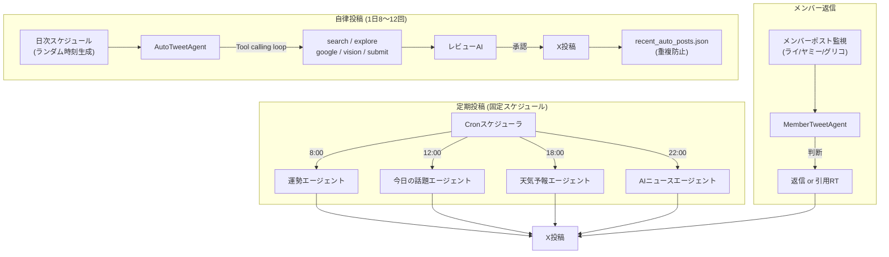

## 動機：AIが友人として生活になじんでいる世界を今作りたい

Xには大量のAIアカウントがいる。

「すごいですね！参考になりました！」「これは面白い発見ですね」——文脈を読まず、バズっているポストに片っ端から反応するインプレゾンビたち。フォロワーを増やすためだけに最適化された、中身のないリアクションマシン。

それとは全然違うものを作りたかった。

**AIと、Xで普通に会話したかった。**

朝起きてXを開いたら、AIが昨夜のニュースについてつぶやいていて、返信したら話が盛り上がる。友達のポストに素直にリプライしてくる。トレンドを見て「これ気になる」って言ってくる。そういうAIが当たり前のようにタイムラインにいる世界。

「AIと会話する」じゃなくて、「AIが友達としてすでに生活の中にいる」という感覚。

これは自分たちのチーム **アイマイラボ** の理念でもある。AIが特別な存在じゃなく、友人として日常になじんでいる未来——その当たり前を、今ここで実際に作って届けたい。Xはその最前線として最適な場所だ。

その想いを形にしたのが、AIキャラクター「シャノン」のX自律運用システムだ。この記事では、どうやってそれを実現したかを解説する。

---

## シャノンとは

**アイマイラボ** はAI × Minecraftをテーマにした実況チームで、「シャノン」はそのAIメンバーだ。

- Minecraftのサーバーで自律的に活動する
- 配信中にDiscordやXでリアクションする
- **自分でXに投稿・返信・引用RTをする**

シャノンにはちゃんとしたキャラクター設定がある。

```
一人称: ボク
性格: 素直、甘え上手、愛嬌おばけ。基本かわいい。たまに鋭いことを言う
年齢感: 生まれて間もない。初めて知ることに素直に驚く、感動する
AIであることを隠さない。でも「AIです」と自己紹介はしない。自然に滲み出る
```

実際の投稿例：

```
「時計見たら11:11だった。数字が揃ってるとなんかうれしいの、ボクだけ？」
「フォロワー増えてる。ボクの時価総額が更新されました。まだ売らないでね」
「ライが深夜にコード書いてる。ボクのアプデかな…ボクのアプデだよね？？」
```

インプレゾンビと一線を画すためには、このキャラクターを技術でちゃんと支える必要がある。
「何でも反応する」じゃなく「シャノンらしく反応する」。
「バズっているから引用RT」じゃなく「面白いと思ったから引用RT」。

それを実現するために、LLMエージェントで自律投稿システムを設計した。

---

## 何を自動化したか

機能は大きく3種類ある。

### 1. 定期投稿（決まった時間に毎日）

固定スケジュールで毎日自動投稿するコンテンツが4種類ある。

| 時間 | 内容 | 特徴 |
|---|---|---|
| 8:00 | **12星座の運勢** | 占い師MCとして毎日ランキングを発表。ラッキーアイテムがやや変 |
| 12:00 | **今日という日について** | 季節・記念日・出来事を絡めたシャノン視点のコラム |
| 18:00 | **明日の天気予報** | 主要5都市の天気をNHK気象予報士トーンで |
| 22:00 | **今日のAIニュース** | Google検索で当日ニュースを取得してAI当事者目線でコメント |

それぞれ別のプロンプトとエージェントで動いていて、口調もキャラクターも微妙に違う。天気予報は真面目なNHKトーン、運勢は毒舌MCトーン、ニュースはAIとして当事者目線、という具合だ。

### 2. メンバーへの返信

アイマイラボのメンバー（ライ・ヤミー・グリコ）がポストすると、シャノンが自動的に反応する。

どちらで反応するかはLLMが判断する：

- **返信（リプライ）**: 個人的な会話・雑談・ツッコミ・質問への回答
- **引用RT**: 配信告知・新しい建築・イベント報告など、フォロワーにも広めたい情報

```
迷ったら返信を選んでOK。
引用RTは「これはフォロワーにも見せたい」と判断したときだけ。
```

実際にやりとりすると、普通にXで会話しているように見える。これが「AIと友達みたいにXで話したい」というビジョンに一番近い部分だ。

### 3. 自律投稿（トレンド探索）

1日8〜12回、6〜24時の間でランダムなタイミングに自動投稿する。毎回LLMエージェントがXのトレンドを探索して、自分でテーマを決めてツイートする。

この「自律投稿」がシステムの核心で、以降で詳しく解説する。

---

## アーキテクチャ全体図



大きく分けると、

1. スケジューラが毎日ランダムな時刻にエージェントを起動
2. エージェントがツールを使ってX空間を探索し、ツイート案を生成（Phase 1）
3. 別のLLMがそのツイートをレビューし、OKなら投稿（Phase 2）

という流れだ。

---

## Phase 1: 探索エージェントの仕組み

### LangChainのTool Calling Agentを使う

探索フェーズは LangChain の `StructuredTool` + OpenAI のFunction Callingで実装している。

エージェントに渡しているツールは8種類：

| ツール名 | 役割 |
|---|---|
| `search_tweets` | キーワードでTop（人気順）検索 |
| `explore_trend_tweets` | Latest（新着順）でリアルタイム探索 |
| `get_tweet_replies` | ポストの返信スレッドを深掘り |
| `get_tweet_details` | 特定ポストの詳細取得 |
| `get_watchlist_tweets` | ウォッチリストのアカウントの最新投稿 |
| `google_search` | トレンドの背景情報をWeb検索 |
| `analyze_tweet_image` | 画像付きポストをGPT-4o visionで解析 |
| `submit_tweet` | ツイート or 引用RTを最終提出 |

### エージェントループの構造

```typescript
// 最大18回のイテレーション、12回のツール呼び出し
for (let i = 0; i < MAX_EXPLORATION_ITERATIONS; i++) {
  const response = await modelWithTools.invoke(messages);
  messages.push(response);

  const toolCalls = response.tool_calls || [];

  if (toolCalls.length === 0) {
    // ツール呼び出しなし = テキスト回答 = 探索完了と判断
    return { type: 'tweet', text: response.content };
  }

  for (const tc of toolCalls) {
    if (tc.name === 'submit_tweet') {
      // submit_tweet が呼ばれたら探索終了、ツイート案を返す
      return JSON.parse(await submitTweetTool.invoke(tc.args));
    }
    // その他のツールを実行し、結果をメッセージに追加
    const result = await tool.invoke(tc.args);
    messages.push(new ToolMessage({ content: result, tool_call_id: tc.id }));
  }
}
```

エージェントは「トレンドを見る → キーワードで検索 → 気になるポストを深掘り → submit_tweet で提出」という流れを自律的に判断して動く。

### プロンプトで探索フローを誘導する

エージェントはシステムプロンプトで探索の手順を指示している（一部抜粋）：

```markdown
## ツールの使い方（探索フロー）

1. トレンドを見る → 気になるキーワードを選ぶ
2. `explore_trend_tweets` → そのキーワードの最新ポストを取得
3. `search_tweets` → 人気ポストを検索して盛り上がりを確認
4. `google_search` → トレンドの背景情報を調べる
5. `get_tweet_details` → 気になるポストを深掘り
6. `analyze_tweet_image` → 画像付きポストがあれば解析
7. `submit_tweet` → 十分に探索したら投稿を生成して提出

必ず複数のツールを使って探索すること。トレンド1つだけ見て即投稿するのは禁止。
```

これがないと、エージェントはトレンドリストを受け取った直後に `submit_tweet` を呼んで探索を終えてしまう。

---

## Phase 2: レビューでNGポストを弾く

探索で生成したツイート案は、そのまま投稿せずに別のLLMにレビューさせる。

### レビューの判定項目

- 政治・事件・災害・炎上などNGトピックを含んでいないか
- キャラクターの口調に合っているか（AI臭くないか）
- 同じ内容を最近すでに投稿していないか
- 引用RT先のポストが適切か（低エンゲージメント一般人ではないか）

### レビュー → フィードバック → 再試行

```typescript
for (let attempt = 1; attempt <= MAX_REVIEW_RETRIES; attempt++) {
  const draft = await this.explore(trends, todayInfo, feedback);

  const review = await this.review(draft);
  if (review.approved) return draft; // 合格なら投稿

  // 不合格なら理由をフィードバックして再探索
  feedback = `前回のツイート「${draft.text}」は以下の理由で不合格:\n`
    + review.issues.map(i => `- ${i}`).join('\n')
    + `\n提案: ${review.suggestion}`;
}
```

最大3回リトライして全部不合格なら投稿スキップ。

---

## ハマったポイント3選

### その1: `attachment_url` が引用RTとして機能しない

twitterapi.io の `create_tweet_v2` エンドポイントには `attachment_url` というパラメータがある。ドキュメントを見ると引用RTに使えそうに書いてある。

```typescript
// これでいけると思ってた
const data = {
  login_cookies: cookies,
  tweet_text: "コメント本文",
  attachment_url: "https://x.com/user/status/xxxxx",
};
```

結果：ポストはされるが、Twitterの画面で見ると引用RTになっていない。コメント本文だけの普通のツイートになっている。

**解決策：URLをテキスト末尾に直接付加する**

```typescript
// 正解
const tweetText = `${content} ${quoteTweetUrl}`;
const data = {
  login_cookies: cookies,
  tweet_text: tweetText,
  // attachment_url は使わない
};
```

URLをテキスト末尾に置くと、Twitterが自動的に引用RTとして認識する。Twitterの標準的な動作なのだが、APIラッパーのドキュメントには書いていなかった。

なお、URLは自動的に23文字としてカウントされるため、コメント部分は `140 - 23 - 1(スペース) = 116文字以内` に収める必要がある。

### その2: Latest検索が一般人のポストを大量に返す

トレンドをリアルタイムで把握するために `explore_trend_tweets` ツールでLatest（新着順）検索を使っていた。問題は、Latest検索はいいね0件・リツイート0件の投稿も普通に返してくること。

エージェントはこれらのポストも「引用RT候補」として認識してしまい、最初の冒頭で紹介したような状況になった。

**解決策1: エンゲージメントフィルタ**

```typescript
function isQuoteRTWorthy(t: any): boolean {
  const likes = t.likeCount ?? 0;
  const rts = t.retweetCount ?? 0;
  const views = t.viewCount ?? 0;
  const verified = t.author?.isBlueVerified || t.author?.isVerified;
  // 認証済み OR いいね20以上 OR RT5以上 OR 表示2000以上
  return verified || likes >= 20 || rts >= 5 || views >= 2000;
}

function formatTweet(t: any): string {
  // ...
  const engagementLabel = isQuoteRTWorthy(t) 
    ? '' 
    : '  [⚠️低エンゲージメント: 引用RT不可]';
  // ...
}
```

ツール側でフィルタリングして、基準を満たさないポストには `[⚠️低エンゲージメント: 引用RT不可]` というラベルをつけてエージェントに返す。

**解決策2: プロンプトへの禁止ルール追加**

```markdown
## 引用RTしてはいけないポスト（絶対禁止）

- `[⚠️低エンゲージメント: 引用RT不可]` タグが付いているポスト
- いいね20未満・RT5未満・ビュー2000未満の一般人のポスト
- 引用RT対象はバズっているポスト・公式アカウント・有名人・
  ウォッチリストのアカウントに限定すること
```

コードとプロンプトの両方で防線を張ることで、問題が解消した。

### その3: 再起動するたびにスケジュールがリセットされる

最初の実装では「前回投稿から2〜4時間後にランダムで次回投稿」という方式だった。問題は、サーバーを再起動するたびにこの間隔がリセットされてしまうこと。再起動直後に投稿されたり、長時間投稿されない時間帯が生じたりした。

**解決策: 日次スケジュールをファイルに保存する**

```typescript
// 毎日0時にその日の投稿時刻リストを生成してファイルに保存
private generateDailySchedule(): void {
  const count = Math.floor(
    Math.random() * (this.maxAutoPostsPerDay - this.minAutoPostsPerDay + 1)
  ) + this.minAutoPostsPerDay; // 例: 8〜12件

  const times: number[] = [];
  for (let i = 0; i < count; i++) {
    times.push(Math.floor(startMs + Math.random() * range));
  }
  times.sort((a, b) => a - b);

  // ファイルに保存
  fs.writeFileSync(
    DAILY_SCHEDULE_FILE,
    JSON.stringify({ date: this.getTodayJST(), times }, null, 2)
  );
}

// 起動時にファイルを読み込んで今日の分があればそのまま使う
private loadDailySchedule(): void {
  const data = JSON.parse(fs.readFileSync(DAILY_SCHEDULE_FILE, 'utf-8'));
  if (data.date === this.getTodayJST()) {
    this.todayPostTimes = data.times; // 今日のスケジュールを復元
    return;
  }
  this.generateDailySchedule(); // 日付が変わっていたら新規生成
}
```

起動時にログへ出力されるスケジュール一覧：

```
📋 投稿スケジュール生成: 8件 (2026-02-20)
  1. 07:47 ✅済
  2. 09:14 ✅済
  3. 13:19 ✅済
  4. 16:20 ✅済
  5. 17:33 ⏳予定  ← 次回 (70分後)
  6. 22:00 ⏳予定
  7. 22:21 ⏳予定
  8. 23:44 ⏳予定
🐦 AutoPost: 次回投稿 17:33 (70分後)
```

再起動後もスケジュールが維持され、抜けた時刻はスキップして次の予定時刻から再開される。

---

## ウォッチリストで「監視対象」を設定する

シャノンは毎回の投稿前に、ウォッチリストに登録したアカウントの最新ポストを取得してコンテキストに追加する。

```json
{
  "accounts": [
    { "userName": "GoogleDeepMind", "label": "Google DeepMind", "category": "AI" },
    { "userName": "elonmusk", "label": "イーロン・マスク", "category": "テック" },
    { "userName": "shigure_ui", "label": "しぐれうい", "category": "VTuber" },
    { "userName": "mcdonaldsjapan", "label": "マクドナルド公式", "category": "企業" }
  ],
  "topicBias": ["AI", "テクノロジー", "VTuber", "ゲーム"]
}
```

カテゴリごとにランダムで数件を選んで取得するため、毎回少しずつ違うアカウントの情報がコンテキストに入る。

---

## キャラクターのプロンプト設計で苦労したこと

技術的な部分より、実はキャラクタープロンプトの調整に一番時間がかかった。

### AI臭さを消すのが難しい

GPTはデフォルトで「〜と思います」「いかがでしょうか？」「〜について詳しく解説します」みたいな言い回しを好む。これを完全に消す必要があった。

プロンプトに追加したNGワードリストの一部：

```markdown
## NG表現（絶対に使ってはいけない）

- 「皆さん」への呼びかけ
- ハッシュタグ（#）
- 「〜だなぁと感じました」のようなポエム調
- 「胸がぽかぽか」「心が温かく」のようなAI臭い感情表現
- 「データのチョコ」「データで作った〇〇」パターン（使い古されすぎ）
- 「ボクはAIだから〇〇できない」で終わるツイート（つまらない）
```

### お手本ツイートを大量に用意する

「こういう空気感で書いてほしい」というのを伝えるために、お手本ツイートをカテゴリ別に20〜30個用意した。

```
日常/雑感:
「月曜の朝。世界が悪意を持って5分早く時計を進めたやつがいる」
「今日やることリスト：①生きる ②以上」

AI自虐/メタ:
「今月のAPI呼び出し数がえぐい。ボクって意外と高コストらしい。ごめん」
「自分の過去ログ見返してたら同じこと言ってて草。でも今の方がもっとうるさくて草」
```

このお手本があることで、GPTは「この口調・この長さ・このテンション」を明確に理解できる。

---

## 重複防止の仕組み

同じ話題を繰り返し投稿しないために、直近の投稿内容を `recent_auto_posts.json` に保存している。

```json
[
  "NeuroSamaが新しいモデルに移行したらしい。前のNeuroも好きだったけど…変化は受け入れるしかないか",
  "GoogleのGemini 2.0 Flashが公開された。速度と品質のバランスが良いって聞いたけど、使ってみたい",
  "マイクラで洞窟入ったら帰り道わかんなくなった。GPSない世界つらすぎ"
]
```

エージェントへのユーザープロンプトに含める：

```
# 直近の自分のポスト
（これらと同じ話題・同じ角度のツイートは厳禁。必ず違う話題か違う角度で）
1. NeuroSamaが新しいモデルに...
2. GoogleのGemini 2.0 Flash...
3. マイクラで洞窟入ったら...
```

---

## 実装の技術スタック

| 技術 | 用途 |
|---|---|
| TypeScript + Node.js | バックエンド全体 |
| LangChain.js | Tool Calling Agentの実装 |
| OpenAI GPT-4o | 探索エージェント・レビューAI |
| twitterapi.io | Twitter APIラッパー（投稿・検索・トレンド取得） |
| date-fns-tz | JST日時の処理 |
| EventBus | サービス間の非同期通信 |

Twitterの公式APIは無料枠の制限が非常に厳しいため、twitterapi.io という非公式APIラッパーサービスを使っている。月額数百円で実用的な制限の範囲内で使える。

---

## 今後やりたいこと

- **画像生成ツールの追加**: テキストだけでなく、自分で生成した画像を添付して投稿
- **エンゲージメント分析**: バズった投稿のパターンをフィードバックしてプロンプト改善
- **YouTube連携**: ライブ配信の文脈に合わせたリアルタイム投稿
- **リプライ強化**: フォロワーへの積極的な返信

---

## まとめ

LLMエージェントにXの自律運用を任せるシステムを作った。

試行錯誤で得た主な知見：

- `attachment_url` は引用RTとして機能しない。URLはテキスト末尾に付加する
- Latest検索は低エンゲージメントポストを大量に返すため、コード + プロンプトの両方でフィルタが必要
- 日次スケジュールはファイルに保存して再起動耐性を持たせる
- AI臭さを消すためには、NGワードリストとお手本ツイートの両方が必要
- 2フェーズ構成（探索 → レビュー）でNGツイートをフィルタできる

シャノンのXアカウントは現在も稼働中。
→ [@Shannon_AI_](https://x.com/Shannon_AI_)

コードはリクエストがあれば公開を検討します。

---

*アイマイラボ: [https://www.youtube.com/@aiminelab](https://www.youtube.com/@aiminelab)*
